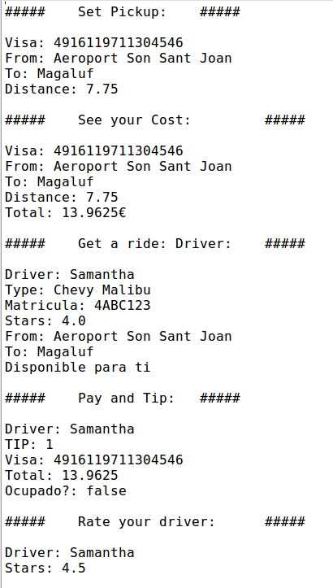
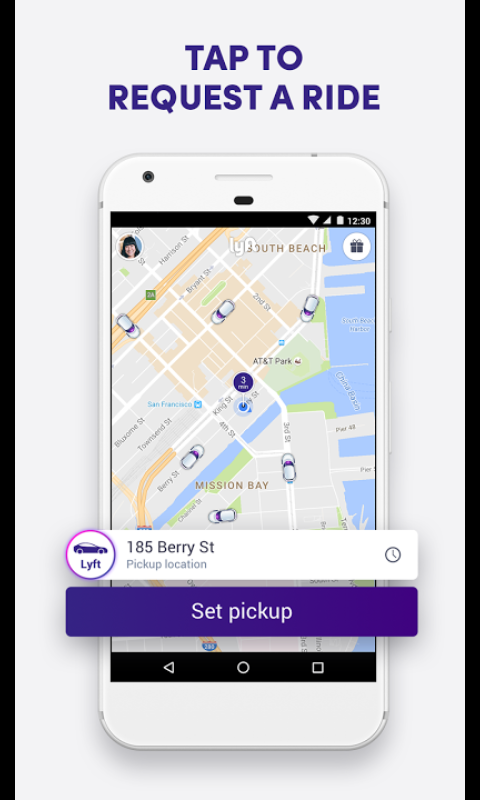
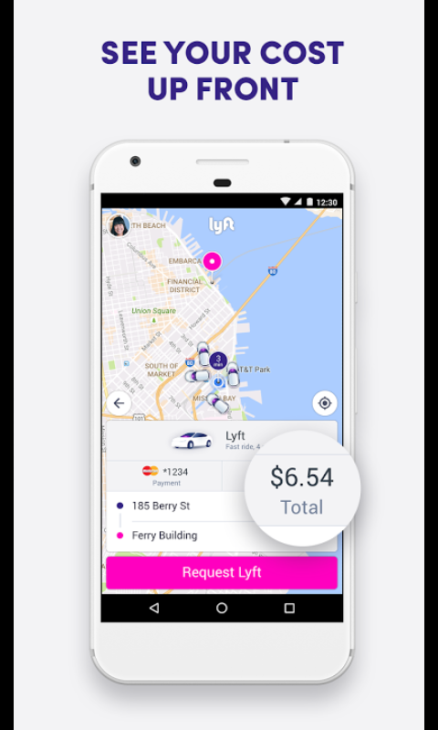
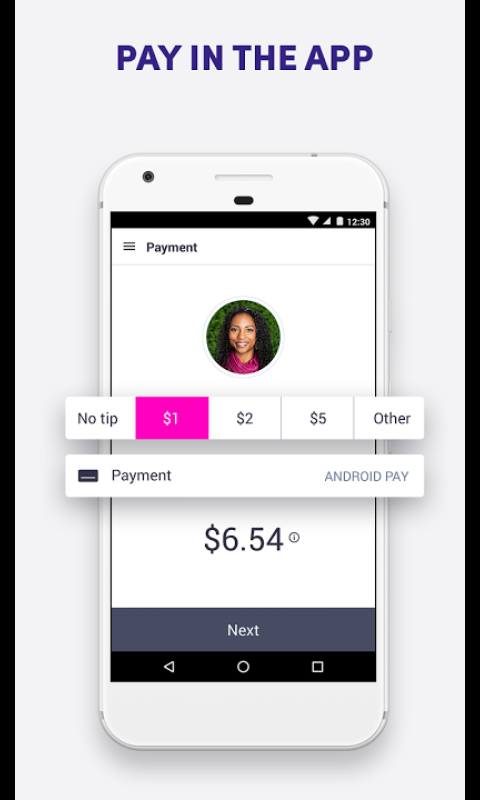

# Cotxox exam

This is a repository in which I will solve the exam that consist on creating a program that reproduce the functionality of the app called
"Cotxox"

I will use mainly all the information that is located [here](./doc/) and Test Driven Development (TDD) to create the software needed to complete the exam. In case you want to check the solution of my teacher: [dfleta-cotxox](https://github.com/dfleta/cotxox)

## UML Class Diagram

Here is the UML class diagram my teacher provided to create the software.

## CLI Output

To keep checking if the main APP works like it should, There exits the following output that allow me to continue adding new features:

## User stories

As you can see the previous cli output is a representation about how should it look in a real app but in a CLI.

* Set pickup

* See your cost

* Get a ride: driver.

* Pay and tip.

* Rate driver

